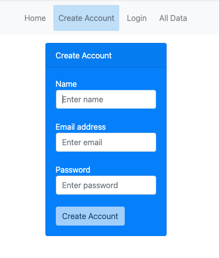
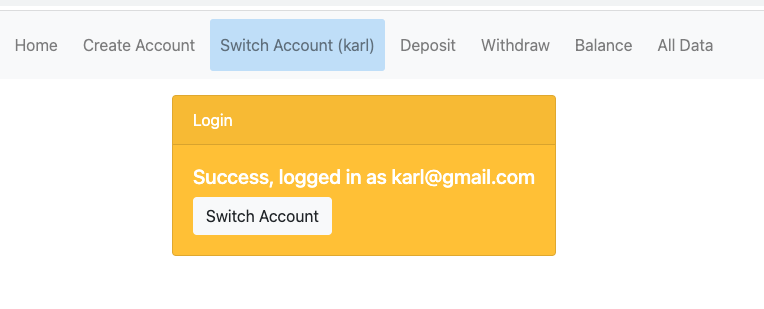
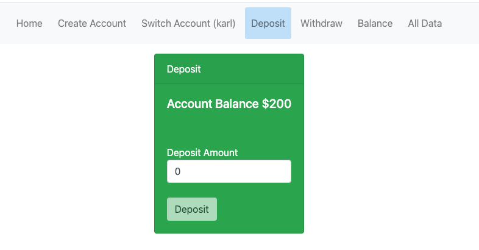

# Bad Bank

## Description Of The Project:

Bank simulation. You can open an account, deposit, withdraw and check the balance.
Use at your own risk.

## How To Run:

1. Download repository to your local machine
2. In the terminal run the following:
   ```bash
   $ docker-compose up
   ```
3. Go to http://localhost:3000/

## How to deploy

Deploys to http://alina-fresorger-fullstackbankingapplication.konshin.org

1. Commit code & push to Github
2. [GH Action](https://docs.github.com/en/actions/publishing-packages/publishing-docker-images) pushes image to [Docker Hub](https://hub.docker.com/r/afresorger/badbankbackend)
3. Login to Digital Ocean
   ```bash
   $ ssh root@146.190.123.193
   ```
4. Pull from DH
   ```bash
   $ docker compose pull
   ```
5. Restart services
   ```bash
   $ docker compose up -d
   ```

### Push manually

First, build & push the image to Docker Registry:

```bash
$ docker compose build
$ docker compose push badbankbackend
```

### Digital Ocean Droplet Provisioning (once)

Run `apt install docker-compose` once after DO droplet has been created.

HTTPS setup: https://github.com/wmnnd/nginx-certbot

## Technology used:

MERN stack, Docker, Digital Ocean

## Roadmap Of Future Improvements:

1. Add "if" condition to check NaN deposits and withdrawals
2. Organize "All Data" page

## Images

 
 


## License Information:

MIT License
